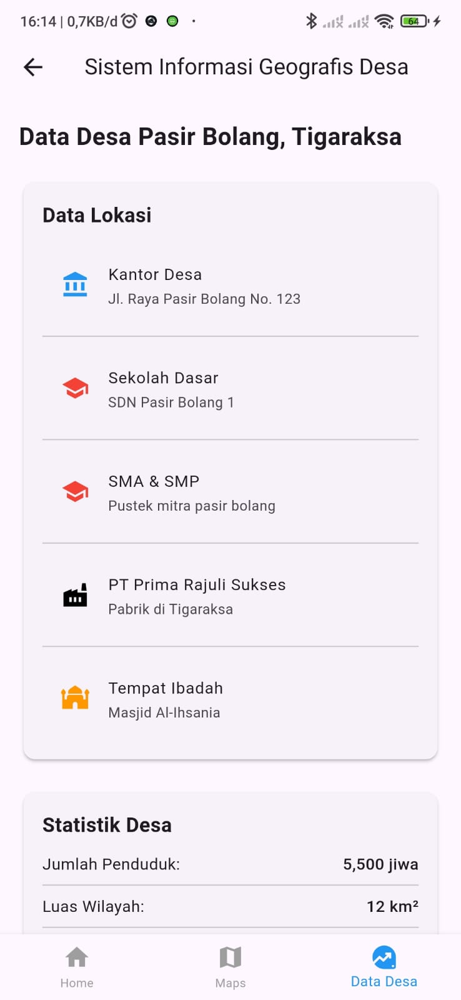

# Sistem Informasi Geografis Desa Pasir Bolang Mobile App

## Deskripsi Aplikasi

Aplikasi **Sistem Informasi Geografis (SIG)** Desa Pasir Bolang adalah solusi digital berbasis mobile yang dirancang untuk mempermudah masyarakat dan pemerintah desa dalam mengakses informasi geografis secara praktis dan interaktif. Aplikasi ini mengintegrasikan peta digital dengan data spesifik desa, seperti batas wilayah, lokasi fasilitas umum, jalur transportasi, dan informasi penting lainnya.

Dengan menggunakan teknologi Geographic Information System (GIS), aplikasi ini memungkinkan masyarakat dan pemerintah desa untuk memperoleh informasi dengan lebih cepat dan akurat.

## Tujuan Aplikasi

- **Akses Mudah:** Menyediakan akses mudah ke data geografis desa yang akurat.
- **Meningkatkan Transparansi:** Membantu meningkatkan transparansi dan keterbukaan informasi.
- **Partisipasi Masyarakat:** Memfasilitasi partisipasi masyarakat dalam pembangunan desa.
- **Pengambilan Keputusan Berbasis Data:** Mendukung pengambilan keputusan berbasis data untuk pembangunan desa.

## Lingkup Aplikasi

- **Akses Data Terbatas:** Aplikasi hanya menampilkan data yang telah disetujui untuk dipublikasikan oleh pemerintah desa.
- **Data yang Ditampilkan:** Hanya mencakup wilayah Desa Pasir Bolang, tidak termasuk desa atau wilayah lain.

## Fitur Utama

### 1. Peta Interaktif

Pengguna dapat melihat peta digital yang menampilkan:

- Batas desa
- Fasilitas umum (sekolah, puskesmas, kantor desa, dll.)
- Jalur transportasi

### 2. Geolokasi dan Penandaan Titik

- Menggunakan GPS perangkat untuk mendeteksi lokasi pengguna.
- Penandaan lokasi penting yang relevan untuk diperbarui di peta.

### 3. Pembaruan Data Real-time

- Pemerintah desa dapat memperbarui data geografis dan informasi terkait secara real-time.
- Pembaruan informasi seperti perubahan fasilitas atau batas wilayah desa.

## Alur Proses

1. Pengguna membuka aplikasi **Sistem Informasi Geografis Desa Pasir Bolang** di perangkat mereka.
2. Memilih fitur peta desa di menu utama.
3. Peta desa muncul dengan informasi geografis dan fasilitas umum.
4. Pengguna dapat menggulir dan zoom in/out peta.
5. Pengguna mengetuk titik di peta untuk melihat informasi lebih lanjut dan bisa menelusuri rute dengan aplikasi Google Maps.
6. Setelah selesai, pengguna dapat kembali ke menu utama atau keluar aplikasi.

### digram process flows


## Spesifikasi Teknis

### Teknologi yang Digunakan

- **Platform:** Mobile (Android/iOS)
- **GIS:** Integrasi dengan peta digital dan data geografis.
- **Geolokasi:** Menggunakan GPS perangkat untuk lokasi otomatis.
- **Backend:** Pembaruan data dilakukan oleh pemerintah desa secara real-time.

### Fitur Tambahan

- **Antarmuka yang Ramah Pengguna:** Desain sederhana dan mudah digunakan.
- **Efisiensi Pengelolaan Data:** Pembaruan data yang cepat dan akurat.

## Cara Instalasi

1. **Clone Repositori:**
   ```bash
   git clone https://github.com/username/repo-name.git
   ```



